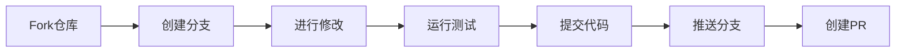

# Contributing to YYC³ Portable Intelligent AI System

> **言启象限 | 语枢未来**
> *Words Initiate Quadrants, Language Serves as Core for Future*

感谢您有兴趣为 YYC³ 便携式智能 AI 系统做出贡献！本文档将帮助您了解如何参与项目开发。

## 📑 目录

- [行为准则](#行为准则)
- [如何贡献](#如何贡献)
- [开发环境设置](#开发环境设置)
- [项目结构](#项目结构)
- [编码规范](#编码规范)
- [提交规范](#提交规范)
- [Pull Request 流程](#pull-request-流程)
- [问题报告](#问题报告)
- [功能建议](#功能建议)

---

## 行为准则

本项目采用贡献者公约作为行为准则。参与此项目即表示您同意遵守其条款。请阅读 [CODE_OF_CONDUCT.md](CODE_OF_CONDUCT.md) 了解详情。

---

## 如何贡献

### 贡献类型

我们欢迎以下类型的贡献：

- 🐛 **Bug 修复** - 修复现有问题
- ✨ **新功能** - 添加新特性
- 📖 **文档改进** - 完善文档
- 🎨 **代码优化** - 重构和性能优化
- 🧪 **测试补充** - 增加测试覆盖率
- 🔧 **配置优化** - 改进配置文件

### 贡献流程



---

## 开发环境设置

### 前置要求

| 工具 | 版本 | 说明 |
|------|------|------|
| Node.js | >= 18.0.0 | JavaScript 运行时 |
| pnpm | >= 8.0.0 | 包管理器（推荐） |
| Git | >= 2.30.0 | 版本控制 |
| VS Code | Latest | 推荐编辑器 |

### 安装步骤

```bash
# 1. Fork 并克隆仓库
git clone https://github.com/YOUR_USERNAME/YYC3-Portable-Intelligent-AI-System.git

# 2. 进入项目目录
cd YYC3-Portable-Intelligent-AI-System

# 3. 安装依赖
pnpm install

# 4. 启动开发服务器
pnpm dev

# 5. 运行测试
pnpm test
```

### VS Code 推荐扩展

```json
{
  "recommendations": [
    "dbaeumer.vscode-eslint",
    "esbenp.prettier-vscode",
    "bradlc.vscode-tailwindcss",
    "ms-vscode.vscode-typescript-next",
    "formulahendry.auto-rename-tag",
    "naumovs.color-highlight",
    "streetsidesoftware.code-spell-checker"
  ]
}
```

---

## 项目结构

```
YYC3-Portable-Intelligent-AI-System/
├── .github/              # GitHub 配置
├── docs/                 # 文档
├── public/               # 静态资源
├── src/
│   ├── app/
│   │   ├── components/   # React 组件
│   │   ├── services/     # 业务服务
│   │   ├── utils/        # 工具函数
│   │   └── App.tsx       # 根组件
│   └── main.tsx          # 入口文件
├── tests/                # 测试文件
└── package.json          # 项目配置
```

---

## 编码规范

### TypeScript/React 规范

#### 文件头注释

所有源代码文件必须包含标准文件头：

```typescript
/**
 * @file 文件名
 * @description 文件描述
 * @author YanYuCloudCube Team <admin@0379.email>
 * @version v1.0.0
 * @created YYYY-MM-DD
 * @updated YYYY-MM-DD
 * @status stable | beta | alpha | deprecated
 * @license MIT
 * @copyright Copyright (c) 2026 YanYuCloudCube Team. All rights reserved.
 * @tags tag1, tag2, tag3
 */
```

#### 命名规范

| 类型 | 规范 | 示例 |
|------|------|------|
| 组件 | PascalCase | `UserProfile.tsx` |
| 函数 | camelCase | `getUserData()` |
| 常量 | UPPER_SNAKE_CASE | `MAX_RETRY_COUNT` |
| 接口 | PascalCase + I前缀 | `IUserService` |
| 类型 | PascalCase | `UserConfig` |
| 文件 | kebab-case | `user-service.ts` |

#### 组件规范

```typescript
import React from 'react'
import { cn } from '@/utils/cn'

interface ButtonProps {
  variant?: 'primary' | 'secondary'
  size?: 'sm' | 'md' | 'lg'
  children: React.ReactNode
  onClick?: () => void
}

export const Button: React.FC<ButtonProps> = ({
  variant = 'primary',
  size = 'md',
  children,
  onClick
}) => {
  return (
    <button
      className={cn(
        'base-button-styles',
        `variant-${variant}`,
        `size-${size}`
      )}
      onClick={onClick}
    >
      {children}
    </button>
  )
}
```

### CSS/Tailwind 规范

- 使用 Tailwind CSS 工具类优先
- 复杂样式使用 CSS Modules 或 styled-components
- 颜色使用设计系统定义的变量
- 响应式设计遵循 mobile-first 原则

### 代码质量工具

```bash
# 运行 ESLint
pnpm lint

# 自动修复 ESLint 问题
pnpm lint:fix

# 格式化代码
pnpm format

# TypeScript 类型检查
pnpm typecheck
```

---

## 提交规范

### Commit Message 格式

我们使用 [Conventional Commits](https://www.conventionalcommits.org/) 规范：

```
<type>(<scope>): <subject>

<body>

<footer>
```

### Type 类型

| Type | 说明 | 示例 |
|------|------|------|
| `feat` | 新功能 | `feat: add user authentication` |
| `fix` | Bug 修复 | `fix: resolve login issue` |
| `docs` | 文档更新 | `docs: update README` |
| `style` | 代码格式 | `style: format code` |
| `refactor` | 重构 | `refactor: optimize user service` |
| `perf` | 性能优化 | `perf: improve rendering speed` |
| `test` | 测试 | `test: add unit tests` |
| `chore` | 构建/工具 | `chore: update dependencies` |
| `ci` | CI/CD | `ci: update workflow` |

### Scope 范围

常用范围：

- `components` - 组件相关
- `services` - 服务相关
- `utils` - 工具函数
- `docs` - 文档
- `config` - 配置
- `ui` - UI 相关

### 示例

```bash
# 新功能
git commit -m "feat(components): add Button component with variants"

# Bug 修复
git commit -m "fix(services): resolve API timeout issue"

# 文档更新
git commit -m "docs: update installation guide"

# 重构
git commit -m "refactor(utils): optimize date formatting function"

# 性能优化
git commit -m "perf(components): implement virtual scrolling for list"
```

---

## Pull Request 流程

### 创建 Pull Request

1. **确保通过所有检查**

```bash
# 运行所有检查
pnpm lint && pnpm typecheck && pnpm test:run
```

2. **创建 Pull Request**

- 使用清晰的标题和描述
- 关联相关 Issue
- 添加适当的标签
- 请求代码审查

### PR 模板

```markdown
## 描述
简要描述此 PR 的更改

## 更改类型
- [ ] Bug 修复
- [ ] 新功能
- [ ] 重构
- [ ] 文档更新
- [ ] 性能优化

## 测试
- [ ] 已添加测试
- [ ] 所有测试通过

## 截图
如有 UI 更改，请添加截图

## 相关 Issue
Closes #issue_number
```

### 代码审查

所有 PR 都需要至少一位维护者的审查才能合并。

审查重点：

- 代码质量和可读性
- 测试覆盖率
- 性能影响
- 安全性考虑
- 文档完整性

---

## 问题报告

### Bug 报告

创建 Bug 报告时，请包含：

1. **问题描述** - 清晰描述问题
2. **复现步骤** - 详细的复现步骤
3. **预期行为** - 期望的正确行为
4. **实际行为** - 实际发生的错误行为
5. **环境信息** - 操作系统、Node 版本等
6. **截图** - 如适用，添加截图
7. **日志** - 相关的错误日志

### Bug 报告模板

```markdown
## Bug 描述
[清晰简洁地描述问题]

## 复现步骤
1. 进入 '...'
2. 点击 '...'
3. 滚动到 '...'
4. 看到错误

## 预期行为
[描述应该发生什么]

## 实际行为
[描述实际发生了什么]

## 环境信息
- OS: [e.g. macOS 14.0]
- Node: [e.g. 18.17.0]
- pnpm: [e.g. 8.6.0]
- Browser: [e.g. Chrome 120.0]

## 截图
[如适用，添加截图]

## 日志
```
[粘贴相关日志]
```
```

---

## 功能建议

### 提交功能建议

创建功能建议时，请包含：

1. **功能描述** - 详细描述建议的功能
2. **使用场景** - 该功能的应用场景
3. **预期效果** - 功能实现后的效果
4. **替代方案** - 考虑过的其他方案
5. **附加信息** - 其他相关信息

### 功能建议模板

```markdown
## 功能描述
[清晰详细地描述建议的功能]

## 使用场景
[描述该功能的应用场景和用户需求]

## 预期效果
[描述功能实现后的预期效果]

## 替代方案
[描述考虑过的其他解决方案]

## 附加信息
[添加其他相关信息、截图或示例]
```

---

## 开发技巧

### 调试技巧

```typescript
// 使用 console.debug 进行调试
console.debug('Debug info:', data)

// 使用 debugger 断点
debugger

// 使用 React DevTools
// 安装 React Developer Tools 浏览器扩展
```

### 性能分析

```bash
# Bundle 分析
pnpm report:bundle

# 性能基准测试
pnpm report:performance

# 内存分析
# 使用 Chrome DevTools Memory Panel
```

### 常见问题

**Q: 依赖安装失败？**

```bash
# 清除缓存
pnpm store prune

# 重新安装
rm -rf node_modules pnpm-lock.yaml
pnpm install
```

**Q: 测试失败？**

```bash
# 更新快照
pnpm test -u

# 查看详细输出
pnpm test --reporter=verbose
```

**Q: 类型错误？**

```bash
# 重新生成类型
pnpm typecheck

# 重启 TypeScript 服务器
# VS Code: Cmd+Shift+P -> TypeScript: Restart TS Server
```

---

## 许可证

通过贡献代码，您同意您的贡献将根据项目的 MIT 许可证进行授权。

---

## 联系方式

如有任何问题，请通过以下方式联系我们：

- 📧 Email: [admin@0379.email](mailto:admin@0379.email)
- 💬 Discord: [YYC³ Community](https://discord.gg/yyc3)
- 🐛 Issues: [GitHub Issues](https://github.com/YYC-Cube/YYC3-Portable-Intelligent-AI-System/issues)

---

<div align="center">

**感谢您的贡献！**

*言启象限 | 语枢未来*

[](https://github.com/YYC-Cube)

</div>
