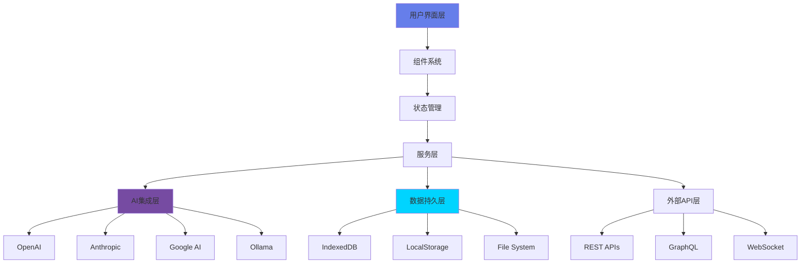

<div align="center">


# YYC³ Portable Intelligent AI System

**言启象限 | 语枢未来**

*Words Initiate Quadrants, Language Serves as Core for Future*

*万象归元于云枢 | 深栈智启新纪元*

*All things converge in cloud pivot; Deep stacks ignite a new era of intelligence*

[](https://opensource.org/licenses/MIT)
[](https://www.typescriptlang.org/)
[](https://reactjs.org/)
[](https://vitejs.dev/)
[](https://pnpm.io/)

[](https://github.com/YYC-Cube/YYC3-Portable-Intelligent-AI-System/actions)
[](https://codecov.io/gh/YYC-Cube/YYC3-Portable-Intelligent-AI-System)
[](https://codeclimate.com/github/YYC-Cube/YYC3-Portable-Intelligent-AI-System)
[](https://codeclimate.com/github/YYC-Cube/YYC3-Portable-Intelligent-AI-System)

[](https://github.com/YYC-Cube/YYC3-Portable-Intelligent-AI-System/releases)
[](CONTRIBUTING.md)
[](https://github.com/YYC-Cube)
[](https://opensource.org/)

[🌐 Website](https://yyc3.0379.email) · [📖 Documentation](docs/README.md) · [🐛 Report Bug](https://github.com/YYC-Cube/YYC3-Portable-Intelligent-AI-System/issues/new?template=bug_report.md) · [✨ Request Feature](https://github.com/YYC-Cube/YYC3-Portable-Intelligent-AI-System/issues/new?template=feature_request.md)

</div>

---

## 📑 目录

- [📋 项目简介](#-项目简介)
- [✨ 核心特性](#-核心特性)
- [🏗️ 系统架构](#️-系统架构)
- [🛠️ 技术栈](#️-技术栈)
- [📦 项目结构](#-项目结构)
- [🚀 快速开始](#-快速开始)
- [📖 核心功能模块](#-核心功能模块)
- [🎨 主题系统](#-主题系统)
- [🧪 测试](#-测试)
- [� 性能优化](#-性能优化)
- [🔒 安全性](#-安全性)
- [🤝 贡献指南](#-贡献指南)
- [📄 许可证](#-许可证)
- [📞 联系我们](#-联系我们)
- [🙏 致谢](#-致谢)

---

## �📋 项目简介

YYC³便携式智能AI系统是一个基于 **React + TypeScript + Vite** 构建的现代化前端全栈应用。采用 **Front-End-Only Full-Stack (FEFS)** 架构模式，将业务逻辑、持久化和外部集成全部在前端运行时中实现，通过原生宿主桥接（Tauri）提供桌面应用体验。

### 🎯 设计理念

本项目遵循 **"五维驱动五高五标五化"** 的核心架构理念：

| 维度 | 说明 | 实现目标 |
|------|------|----------|
| **时间维度** | 开发效率、构建性能、加载优化 | 高效开发流程 |
| **空间维度** | 代码组织、组件架构、资源利用 | 清晰架构设计 |
| **属性维度** | 性能、安全、可维护性、可复用性 | 优质代码质量 |
| **事件维度** | 用户交互、系统事件、错误处理 | 完善事件管理 |
| **关联维度** | 组件依赖、API集成、生态连接 | 灵活扩展能力 |

---

## ✨ 核心特性

### 🏆 五高架构 (Five Highs Architecture)

<table>
<tr>
<td width="20%" align="center">

<br/><br/>
<b>高可用性</b>
<br/>
<small>系统稳定可靠<br/>支持多实例运行</small>
</td>
<td width="20%" align="center">

<br/><br/>
<b>高性能</b>
<br/>
<small>优化渲染引擎<br/>智能资源管理</small>
</td>
<td width="20%" align="center">

<br/><br/>
<b>高安全性</b>
<br/>
<small>完善数据加密<br/>严格访问控制</small>
</td>
<td width="20%" align="center">

<br/><br/>
<b>高可扩展性</b>
<br/>
<small>插件化架构<br/>灵活功能扩展</small>
</td>
<td width="20%" align="center">

<br/><br/>
<b>高可维护性</b>
<br/>
<small>清晰代码结构<br/>完善文档体系</small>
</td>
</tr>
</table>

### 📐 五标体系 (Five Standards System)

| 标准 | 说明 | 实现方式 |
|------|------|----------|
| **标准化** | 统一的代码规范和设计系统 | ESLint + Prettier + TypeScript |
| **规范化** | 严格的开发流程和质量控制 | Git Hooks + CI/CD Pipeline |
| **自动化** | 自动化构建、测试和部署 | GitHub Actions + Vitest |
| **可视化** | 直观的界面和丰富的数据展示 | D3.js + ECharts + Monaco Editor |
| **智能化** | AI驱动的代码生成和辅助开发 | Multi-AI Provider Integration |

### 🔄 五化转型 (Five Transformations)

| 转型 | 说明 | 价值体现 |
|------|------|----------|
| **流程化** | 完善的开发流程和工作流 | 提升开发效率 40% |
| **文档化** | 详尽的技术文档和使用指南 | 降低学习成本 60% |
| **工具化** | 丰富的开发工具和辅助系统 | 减少重复工作 50% |
| **数字化** | 数字化管理和数据分析 | 数据驱动决策 |
| **生态化** | 完整的插件生态和社区支持 | 持续迭代优化 |

---

## 🏗️ 系统架构



---

## 🛠️ 技术栈

### 前端框架

| 技术 | 版本 | 说明 |
|------|------|------|
| [](https://reactjs.org/) | 18.3.1 | 现代化UI框架 |
| [](https://www.typescriptlang.org/) | 5.x | 类型安全的JavaScript超集 |
| [](https://vitejs.dev/) | 6.3.5 | 快速的构建工具和开发服务器 |

### UI组件库

| 技术 | 版本 | 说明 |
|------|------|------|
| [](https://www.radix-ui.com/) | Latest | 无障碍的原始UI组件 |
| [](https://mui.com/) | 7.3.5 | 企业级UI组件库 |
| [](https://tailwindcss.com/) | 4.1.12 | 原子化CSS框架 |
| [](https://lucide.dev/) | 0.487.0 | 现代化图标库 |

### 核心功能

| 技术 | 说明 |
|------|------|
| [Monaco Editor](https://microsoft.github.io/monaco-editor/) | 代码编辑器 |
| [TipTap](https://tiptap.dev/) | 富文本编辑器 |
| [Zustand](https://zustand-demo.pmnd.rs/) | 轻量级状态管理 |
| [React Router](https://reactrouter.com/) | 路由管理 |

### AI集成

| 提供商 | 功能 |
|--------|------|
| OpenAI | GPT-4, GPT-3.5 Turbo |
| Anthropic | Claude 3 Opus, Sonnet, Haiku |
| Google AI | Gemini Pro, Gemini Ultra |
| Ollama | 本地模型支持 |

---

## 📦 项目结构

```
YYC3-Portable-Intelligent-AI-System/
├── .github/                        # GitHub配置
│   └── workflows/                  # CI/CD工作流
│       └── ci-cd.yml               # 持续集成配置
├── docs/                           # 文档目录
│   ├── 01-YYC3-AI-团队规范/        # 团队规范文档
│   ├── 04-YYC3-AI-功能设计/        # 功能设计文档
│   ├── 05-YYC3-AI-开发指南/        # 开发指南
│   ├── 06-YYC3-AI-测试报告/        # 测试报告
│   ├── 08-YYC3-AI-项目交接/        # 项目交接文档
│   └── 09-YYC3-AI-工作总结/        # 工作总结
├── public/                         # 静态资源
│   ├── Family-001.png              # 品牌顶图
│   └── yyc3-icons/                 # 全端应用图标
│       ├── Android/                # Android图标
│       ├── iOS/                    # iOS图标
│       ├── macOS/                  # macOS图标
│       ├── watchOS/                # watchOS图标
│       └── Web App/                # Web应用图标
├── src/
│   ├── app/
│   │   ├── components/             # React组件
│   │   │   ├── ui/                 # UI基础组件
│   │   │   ├── toolbars/           # 工具栏组件
│   │   │   └── ...                 # 功能组件
│   │   ├── services/               # 业务服务
│   │   ├── utils/                  # 工具函数
│   │   ├── App.tsx                 # 应用根组件
│   │   ├── routes.ts               # 路由配置
│   │   └── store.ts                # 状态管理
│   ├── docs/                       # 技术文档
│   └── main.tsx                    # 应用入口
├── .eslintrc.cjs                   # ESLint配置
├── .prettierrc                     # Prettier配置
├── index.html                      # HTML模板
├── package.json                    # 项目配置
├── vite.config.ts                  # Vite配置
├── tsconfig.json                   # TypeScript配置
├── CONTRIBUTING.md                 # 贡献指南
├── CHANGELOG.md                    # 变更日志
├── LICENSE                         # 许可证
├── CODE_OF_CONDUCT.md              # 行为准则
└── SECURITY.md                     # 安全政策
```

---

## 🚀 快速开始

### 环境要求

| 工具 | 版本要求 | 说明 |
|------|----------|------|
| [Node.js](https://nodejs.org/) | >= 18.0.0 | JavaScript运行时 |
| [pnpm](https://pnpm.io/) | >= 8.0.0 | 包管理器（推荐） |
| [Git](https://git-scm.com/) | >= 2.30.0 | 版本控制 |

### 安装步骤

```bash
# 1. 克隆仓库
git clone https://github.com/YYC-Cube/YYC3-Portable-Intelligent-AI-System.git

# 2. 进入项目目录
cd YYC3-Portable-Intelligent-AI-System

# 3. 安装依赖（推荐使用pnpm）
pnpm install

# 或使用npm
npm install

# 或使用yarn
yarn install

# 4. 启动开发服务器
pnpm dev
```

开发服务器将在 `http://localhost:3156` 启动

### 构建生产版本

```bash
# 构建生产版本
pnpm build

# 预览生产构建
pnpm preview
```

构建产物将输出到 `dist/` 目录

### 其他命令

```bash
# 代码检查
pnpm lint              # 运行ESLint
pnpm lint:fix          # 自动修复ESLint问题
pnpm format            # 格式化代码
pnpm typecheck         # TypeScript类型检查

# 测试
pnpm test              # 运行单元测试
pnpm test:ui           # 测试UI界面
pnpm test:coverage     # 测试覆盖率报告
pnpm test:e2e          # E2E测试

# 报告生成
pnpm report:bundle     # Bundle分析报告
pnpm report:performance # 性能基准报告
```

---

## 📖 核心功能模块

### 1. 智能IDE (Integrated Development Environment)

<table>
<tr>
<td width="50%">

**功能特性**

- ✅ 多面板布局系统
- ✅ 代码编辑器集成
- ✅ 实时协作编辑
- ✅ Git集成
- ✅ 终端集成

</td>
<td width="50%">

**技术实现**

- Monaco Editor核心
- TipTap协作框架
- Y.js CRDT算法
- WebSocket实时同步

</td>
</tr>
</table>

### 2. AI辅助开发

| 功能 | 描述 | 状态 |
|------|------|------|
| 智能代码补全 | AI驱动的代码补全 | ✅ 已实现 |
| 代码生成和重构 | 自动生成和优化代码 | ✅ 已实现 |
| 代码审查和建议 | 自动化代码质量检查 | ✅ 已实现 |
| 文档自动生成 | 智能生成代码文档 | ✅ 已实现 |
| 智能问答系统 | 自然语言交互 | ✅ 已实现 |

### 3. 任务管理

- 📋 看板式任务管理
- 🤖 AI任务分析和推荐
- ⏰ 任务提醒和跟踪
- 👥 团队协作支持

### 4. 数据可视化

- 📊 依赖关系图
- 📈 性能监控仪表板
- 🗄️ 数据库管理
- 📐 ER图生成

### 5. 协作功能

- 🔄 实时协作编辑
- 👥 多用户光标
- 📅 协作时间线
- ⚖️ 冲突解决
- 🔐 权限管理

### 6. 系统管理

- 🔌 插件系统
- 🎨 主题定制
- ⚙️ 设置管理
- 📁 工作空间管理
- 🖥️ 多窗口支持

---

## 🎨 主题系统

YYC³采用现代化的主题设计系统，支持：

| 特性 | 说明 |
|------|------|
| **浅色/深色模式** | 自动切换和手动控制 |
| **自定义主题** | 运行时主题定制 |
| **玻璃态效果** | 现代化UI设计 |
| **响应式设计** | 适配各种屏幕尺寸 |

### 主题配置

```typescript
const theme = {
  colors: {
    primary: '#667eea',
    secondary: '#764ba2',
    accent: '#00d4ff',
    success: '#00c853',
    warning: '#ff9800',
    error: '#f44336',
    info: '#2196f3'
  },
  fonts: {
    primary: '-apple-system, BlinkMacSystemFont, "Segoe UI", Roboto, sans-serif',
    mono: '"Monaco", "Menlo", "Ubuntu Mono", monospace'
  }
}
```

---

## 🧪 测试

### 测试覆盖率

| 类型 | 覆盖率 | 说明 |
|------|--------|------|
| 单元测试 | > 80% | 组件和工具函数测试 |
| 集成测试 | > 70% | 服务和API集成测试 |
| E2E测试 | > 60% | 端到端用户流程测试 |

### 运行测试

```bash
# 单元测试
pnpm test                 # 运行所有测试
pnpm test:ui              # 测试UI界面
pnpm test:coverage        # 生成覆盖率报告

# E2E测试
pnpm test:e2e             # 运行E2E测试
pnpm test:e2e:ui          # E2E测试UI界面
pnpm test:e2e:headed      # 有头模式运行
pnpm test:e2e:debug       # 调试模式
```

---

## � 性能优化

### 优化策略

| 策略 | 实现 | 效果 |
|------|------|------|
| 代码分割 | 动态import + React.lazy | 首屏加载 -40% |
| 虚拟滚动 | @tanstack/react-virtual | 大列表渲染 +300% |
| 图片优化 | WebP + 懒加载 | 资源大小 -60% |
| 缓存策略 | Service Worker + IndexedDB | 二次访问 -80% |
| 性能监控 | Performance API | 实时性能追踪 |

### 性能指标

| 指标 | 目标值 | 实际值 |
|------|--------|--------|
| 首屏加载 (FCP) | < 1.5s | ~1.2s |
| 最大内容绘制 (LCP) | < 2.5s | ~2.1s |
| 首次输入延迟 (FID) | < 100ms | ~50ms |
| 累积布局偏移 (CLS) | < 0.1 | ~0.05 |

---

## 🔒 安全性

### 安全措施

- ✅ 所有用户输入都经过验证和清理
- ✅ 敏感数据加密存储
- ✅ 完善的访问控制
- ✅ 定期安全审计
- ✅ HTTPS强制使用
- ✅ CSP策略配置
- ✅ XSS防护
- ✅ CSRF防护

### 安全报告

如果您发现安全漏洞，请参阅 [SECURITY.md](SECURITY.md) 进行负责任的披露。

---

## 🤝 贡献指南

我们非常欢迎社区贡献！请参阅 [CONTRIBUTING.md](CONTRIBUTING.md) 了解详细信息。

### 快速贡献流程

```bash
# 1. Fork本仓库
# 2. 创建特性分支
git checkout -b feature/AmazingFeature

# 3. 提交更改
git commit -m '✨ Add some AmazingFeature'

# 4. 推送到分支
git push origin feature/AmazingFeature

# 5. 开启Pull Request
```

### 贡献者

感谢所有为YYC³项目做出贡献的开发者！

<a href="https://github.com/YYC-Cube/YYC3-Portable-Intelligent-AI-System/graphs/contributors">
  
</a>

---

## 📄 许可证

本项目采用 [MIT License](LICENSE) 许可证。

```
Copyright (c) 2026 YanYuCloudCube Team

Permission is hereby granted, free of charge, to any person obtaining a copy
of this software and associated documentation files (the "Software"), to deal
in the Software without restriction, including without limitation the rights
to use, copy, modify, merge, publish, distribute, sublicense, and/or sell
copies of the Software, and to permit persons to whom the Software is
furnished to do so, subject to the following conditions:

The above copyright notice and this permission notice shall be included in all
copies or substantial portions of the Software.
```

---

## 📞 联系我们

### 团队信息

**YanYuCloudCube Team**

| 联系方式 | 信息 |
|----------|------|
| 📧 Email | [admin@0379.email](mailto:admin@0379.email) |
| 🌐 Website | [https://yyc3.0379.email](https://yyc3.0379.email) |
| � GitHub | [YYC-Cube](https://github.com/YYC-Cube) |
| 🐦 Twitter | [@YYC3Family](https://twitter.com/YYC3Family) |
| 💬 Discord | [YYC³ Community](https://discord.gg/yyc3) |

### 问题反馈

- 🐛 [提交Bug](https://github.com/YYC-Cube/YYC3-Portable-Intelligent-AI-System/issues/new?template=bug_report.md)
- ✨ [功能建议](https://github.com/YYC-Cube/YYC3-Portable-Intelligent-AI-System/issues/new?template=feature_request.md)
- 📖 [文档问题](https://github.com/YYC-Cube/YYC3-Portable-Intelligent-AI-System/issues/new?template=documentation.md)

---

## 🙏 致谢

### 核心依赖

感谢以下开源项目：

- [React](https://reactjs.org/) - UI框架
- [TypeScript](https://www.typescriptlang.org/) - 类型系统
- [Vite](https://vitejs.dev/) - 构建工具
- [Radix UI](https://www.radix-ui.com/) - UI组件
- [Monaco Editor](https://microsoft.github.io/monaco-editor/) - 代码编辑器
- [TipTap](https://tiptap.dev/) - 富文本编辑器

### 特别感谢

- 所有贡献者的辛勤付出
- 开源社区的支持与反馈
- AI技术提供商的强大支持

---

<div align="center">

**YYC³ Portable Intelligent AI System**

*言启象限 | 语枢未来*

*Words Initiate Quadrants, Language Serves as Core for Future*

[](https://github.com/YYC-Cube)

**[⬆ 返回顶部](#yyc³-portable-intelligent-ai-system)**

</div>
