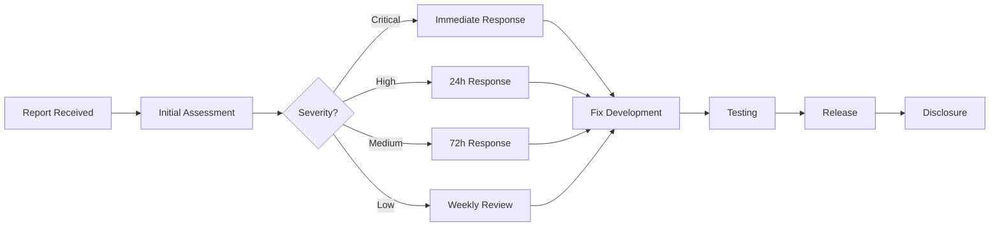

# Security Policy

> **言启象限 | 语枢未来**
> *Words Initiate Quadrants, Language Serves as Core for Future*

## 📑 Table of Contents

- [Supported Versions](#supported-versions)
- [Security Features](#security-features)
- [Reporting a Vulnerability](#reporting-a-vulnerability)
- [Security Best Practices](#security-best-practices)
- [Security Update Policy](#security-update-policy)
- [Security Audit History](#security-audit-history)

---

## Supported Versions

We release patches for security vulnerabilities for the following versions:

| Version | Supported | End of Support |
| ------- | --------- | -------------- |
| 1.0.x   | ✅ Active | -              |
| 0.9.x   | ⚠️ Maintenance | 2026-06-30 |
| < 0.9   | ❌ EOL    | 2026-03-20     |

---

## Security Features

### 🔐 Authentication & Authorization

| Feature | Status | Description |
|---------|--------|-------------|
| JWT Authentication | ✅ | Secure JSON Web Token authentication |
| Session Management | ✅ | Secure session handling with expiration |
| Role-Based Access Control | ✅ | Fine-grained permission system |
| Multi-Factor Authentication | 🚧 | Planned for v1.1.0 |
| OAuth 2.0 Integration | 🚧 | Planned for v1.1.0 |

### 🔒 Data Protection

| Feature | Status | Description |
|---------|--------|-------------|
| Data Encryption at Rest | ✅ | AES-256 encryption for sensitive data |
| Data Encryption in Transit | ✅ | TLS 1.3 for all communications |
| Input Validation | ✅ | Comprehensive input sanitization |
| Output Encoding | ✅ | XSS prevention through encoding |
| SQL Injection Prevention | ✅ | Parameterized queries |

### 🛡️ Network Security

| Feature | Status | Description |
|---------|--------|-------------|
| HTTPS Enforcement | ✅ | Mandatory HTTPS connections |
| Content Security Policy | ✅ | Strict CSP headers |
| CORS Configuration | ✅ | Controlled cross-origin access |
| Rate Limiting | ✅ | API rate limiting |
| DDoS Protection | ✅ | Request throttling |

### 🔍 Monitoring & Logging

| Feature | Status | Description |
|---------|--------|-------------|
| Security Event Logging | ✅ | Comprehensive security logs |
| Intrusion Detection | ✅ | Anomaly detection |
| Audit Trail | ✅ | Complete action logging |
| Real-time Alerts | ✅ | Immediate threat notification |

---

## Reporting a Vulnerability

### 🚨 How to Report

If you discover a security vulnerability, please report it responsibly:

1. **Do NOT** open a public issue
2. **Do NOT** disclose the vulnerability publicly until it's fixed
3. **DO** follow the responsible disclosure process

### 📧 Contact Methods

| Method | Use For | Response Time |
|--------|---------|---------------|
| [security@0379.email](mailto:security@0379.email) | Critical vulnerabilities | < 24 hours |
| [GitHub Security Advisory](https://github.com/YYC-Cube/YYC3-Portable-Intelligent-AI-System/security/advisories) | All vulnerabilities | < 48 hours |
| [GitHub Private Issue](https://github.com/YYC-Cube/YYC3-Portable-Intelligent-AI-System/issues/new?labels=security) | Non-critical issues | < 72 hours |

### 📝 What to Include

Please include the following information in your report:

```markdown
## Vulnerability Report

### Summary
Brief description of the vulnerability

### Severity
- [ ] Critical
- [ ] High
- [ ] Medium
- [ ] Low

### Affected Versions
List of affected versions

### Description
Detailed description of the vulnerability

### Steps to Reproduce
1. Step 1
2. Step 2
3. ...

### Proof of Concept
Code or screenshots demonstrating the vulnerability

### Impact
Potential impact if exploited

### Suggested Fix
If you have suggestions for fixing the issue

### Your Information (Optional)
- Name:
- Email:
- GitHub:
```

### 🔄 Response Process



### 📊 Response Timeline

| Severity | Initial Response | Fix Timeline | Disclosure |
|----------|------------------|--------------|------------|
| Critical | < 24 hours | < 48 hours | After fix |
| High | < 48 hours | < 7 days | After fix |
| Medium | < 72 hours | < 14 days | After fix |
| Low | < 1 week | Next release | With release |

---

## Security Best Practices

### For Developers

#### 🔑 Secrets Management

```bash
# ❌ Never commit secrets
git add .env.local  # BAD

# ✅ Use environment variables
export API_KEY="your-secret-key"

# ✅ Use secret management tools
pnpm install @dotenvx/dotenvx
```

#### 📦 Dependency Security

```bash
# Regular security audits
pnpm audit

# Fix vulnerabilities
pnpm audit --fix

# Update dependencies
pnpm update --latest
```

#### 🔒 Code Security

```typescript
// ❌ Never use eval()
eval(userInput)  // BAD

// ✅ Use safe alternatives
JSON.parse(userInput)  // GOOD

// ❌ Never concatenate SQL
`SELECT * FROM users WHERE id = ${userId}`  // BAD

// ✅ Use parameterized queries
db.query('SELECT * FROM users WHERE id = ?', [userId])  // GOOD
```

### For Users

#### 🔐 Account Security

- Use strong, unique passwords
- Enable two-factor authentication (when available)
- Regularly review account activity
- Keep software updated

#### 🌐 Browser Security

- Use HTTPS connections only
- Enable browser security features
- Install security extensions
- Clear sensitive data after use

---

## Security Update Policy

### 🔄 Update Frequency

| Type | Frequency | Method |
|------|-----------|--------|
| Critical Security Patches | Immediate | Hotfix release |
| Security Updates | Weekly | Patch release |
| Dependency Updates | Bi-weekly | Minor release |
| Major Security Overhauls | As needed | Major release |

### 📢 Notification Channels

- GitHub Security Advisories
- Release Notes
- Email notifications (for critical issues)
- Discord announcements

### 🎯 Update Process

```bash
# Check for updates
pnpm outdated

# Update dependencies
pnpm update

# Run security audit
pnpm audit

# Apply security fixes
pnpm audit --fix

# Test application
pnpm test
```

---

## Security Audit History

### 2026

| Date | Auditor | Scope | Result | Issues Found |
|------|---------|-------|--------|--------------|
| 2026-03-20 | Internal Team | Full Application | ✅ Pass | 0 Critical, 2 Low |
| 2026-02-15 | Internal Team | Authentication | ✅ Pass | 0 Issues |
| 2026-01-10 | Internal Team | Dependencies | ⚠️ Warning | 3 Medium (Fixed) |

### 2025

| Date | Auditor | Scope | Result | Issues Found |
|------|---------|-------|--------|--------------|
| 2025-12-05 | Internal Team | Initial Audit | ✅ Pass | 0 Critical, 5 Low |

---

## Security Configuration

### Content Security Policy

```http
Content-Security-Policy:
  default-src 'self';
  script-src 'self' 'unsafe-inline' 'unsafe-eval';
  style-src 'self' 'unsafe-inline';
  img-src 'self' data: https:;
  font-src 'self' data:;
  connect-src 'self' https://api.openai.com https://api.anthropic.com;
  frame-ancestors 'none';
  base-uri 'self';
  form-action 'self';
```

### HTTP Security Headers

```http
Strict-Transport-Security: max-age=31536000; includeSubDomains; preload
X-Content-Type-Options: nosniff
X-Frame-Options: DENY
X-XSS-Protection: 1; mode=block
Referrer-Policy: strict-origin-when-cross-origin
Permissions-Policy: geolocation=(), microphone=(), camera=()
```

### CORS Configuration

```typescript
const corsOptions = {
  origin: [
    'https://yyc3.0379.email',
    'https://app.yyc3.0379.email'
  ],
  methods: ['GET', 'POST', 'PUT', 'DELETE', 'PATCH'],
  allowedHeaders: ['Content-Type', 'Authorization'],
  credentials: true,
  maxAge: 86400
}
```

---

## Known Security Considerations

### 🔍 Current Considerations

1. **AI API Keys**
   - Stored in browser localStorage
   - Encrypted at rest
   - Never transmitted to third parties

2. **User Data**
   - Stored locally by default
   - Optional cloud sync (encrypted)
   - User has full control

3. **Third-Party Dependencies**
   - Regularly audited
   - Minimal attack surface
   - Pinned versions

### 🚧 Planned Improvements

- Hardware security key support
- Zero-knowledge encryption
- Secure enclave integration
- Advanced threat detection

---

## Security Resources

### 📚 Documentation

- [OWASP Top 10](https://owasp.org/www-project-top-ten/)
- [Web Security Guidelines](https://developer.mozilla.org/en-US/docs/Web/Security)
- [Node.js Security Best Practices](https://nodejs.org/en/docs/guides/security/)

### 🛠️ Tools

- [npm audit](https://docs.npmjs.com/cli/audit)
- [Snyk](https://snyk.io/)
- [GitHub Dependabot](https://github.com/features/security)
- [OWASP ZAP](https://www.zaproxy.org/)

---

## Contact Information

### Security Team

- **Security Email**: [security@0379.email](mailto:security@0379.email)
- **General Contact**: [admin@0379.email](mailto:admin@0379.email)
- **GitHub Security**: [Security Advisories](https://github.com/YYC-Cube/YYC3-Portable-Intelligent-AI-System/security/advisories)

### PGP Key

For encrypted communications, you can use our PGP key:

```text
-----BEGIN PGP PUBLIC KEY BLOCK-----
[PGP Key would be here]
-----END PGP PUBLIC KEY BLOCK-----
```

---

<div align="center">

**Security is everyone's responsibility**

Thank you for helping keep YYC³ safe! 🛡️

*言启象限 | 语枢未来*

[](SECURITY.md)

</div>
