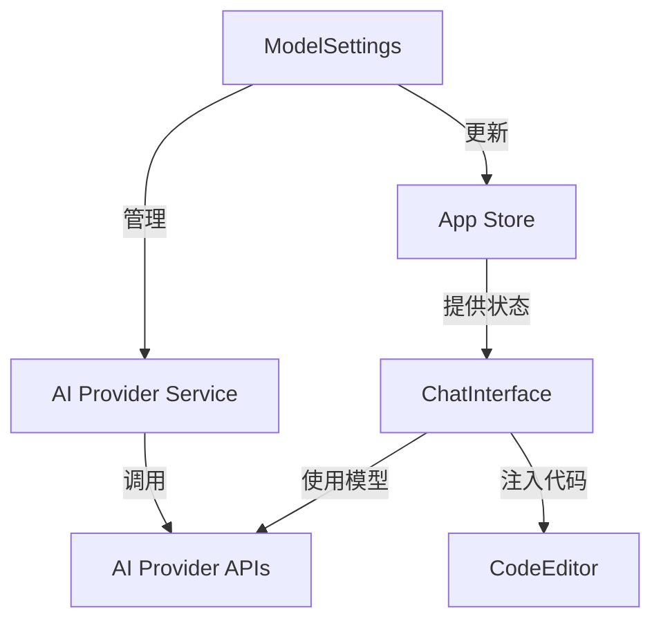

> ***YanYuCloudCube***
> *言启象限 | 语枢未来*
> ***Words Initiate Quadrants, Language Serves as Core for Future***
> *万象归元于云枢 | 深栈智启新纪元*
> ***All things converge in cloud pivot; Deep stacks ignite a new era of intelligence***

---

# YYC³ AI 模型管理中心深度分析报告

**分析时间:** 2025-03-19  
**分析范围:** ModelSettings.tsx, ai-provider.ts, ChatInterface.tsx, store.ts  
**分析维度:** 架构设计、交互流程、数据流、扩展性

---

## 📊 执行摘要

### 系统概览

YYC³ AI 模型管理中心是一个**多提供商、多模型、智能诊断**的 AI 服务管理系统，支持：

- **6 大 AI 提供商** (OpenAI / Claude / 智谱 / 通义千问 / DeepSeek / Ollama)
- **4 个核心功能标签页** (Providers / Ollama / MCP Tools / Smart Diagnostics)
- **完整的模型生命周期管理** (添加/删除/测试/切换)
- **实时性能监控** (延迟测试/错误分析/性能指标)
- **MCP 工具集成** (文件系统/Fetch/PostgreSQL)

---

## 🏗️ 一、架构设计分析

### 1.1 分层架构

```
┌─────────────────────────────────────────────────────────┐
│                   UI 层 (ModelSettings.tsx)              │
│  ┌─────────────┐ ┌─────────────┐ ┌─────────────────┐   │
│  │ ProviderCard│ │ OllamaPanel │ │ MCPConfigPanel  │   │
│  └─────────────┘ └─────────────┘ └─────────────────┘   │
└─────────────────────────────────────────────────────────┘
                            ↓
┌─────────────────────────────────────────────────────────┐
│              服务层 (ai-provider.ts)                     │
│  ┌─────────────┐ ┌─────────────┐ ┌─────────────────┐   │
│  │Provider CRUD│ │Model 管理   │ │Performance 监控 │   │
│  └─────────────┘ └─────────────┘ └─────────────────┘   │
└─────────────────────────────────────────────────────────┘
                            ↓
┌─────────────────────────────────────────────────────────┐
│              状态层 (store.ts)                           │
│  ┌─────────────┐ ┌─────────────┐ ┌─────────────────┐   │
│  │aiModels     │ │activeModel  │ │Model 状态管理   │   │
│  └─────────────┘ └─────────────┘ └─────────────────┘   │
└─────────────────────────────────────────────────────────┘
                            ↓
┌─────────────────────────────────────────────────────────┐
│              交互层 (ChatInterface.tsx)                  │
│  ┌─────────────┐ ┌─────────────┐ ┌─────────────────┐   │
│  │AI 对话      │ │代码注入     │ │System Prompt    │   │
│  └─────────────┘ └─────────────┘ └─────────────────┘   │
└─────────────────────────────────────────────────────────┘
```

### 1.2 核心组件关系



---

## 📦 二、AI 提供商管理分析

### 2.1 提供商配置结构

```typescript
interface ProviderDef {
  id: string              // 唯一标识：'openai', 'claude', 'zhipu'...
  name: string            // 显示名称：'OpenAI', 'Anthropic'...
  shortName: string       // 简称：'GPT', 'Claude', 'GLM'...
  icon: React.ElementType // 图标组件
  color: string           // 主题色：'text-emerald-400'...
  colorBg: string         // 背景色：'bg-emerald-500/10'...
  colorBorder: string     // 边框色：'border-emerald-500/20'...
  description: string     // 描述：'GPT-4o / o3 / o4-mini'
  baseURL: string         // API 端点
  apiKeyUrl: string       // API Key 获取地址
  apiKeyPlaceholder: string
  models: ModelDef[]      // 支持的模型列表
  openaiCompatible: boolean // 是否 OpenAI 兼容
  docsUrl: string         // 文档地址
}
```

### 2.2 六大提供商对比

| 提供商 | ID | 类型 | API 端点 | 模型数量 | 兼容性 |
|--------|----|------|---------|---------|--------|
| **OpenAI** | openai | Cloud | api.openai.com | 4 | 标准 |
| **Anthropic** | claude | Cloud | api.anthropic.com | 2 | 独立 |
| **智谱 AI** | zhipu | Cloud | open.bigmodel.cn | 3 | OpenAI 兼容 |
| **通义千问** | qwen | Cloud | dashscope.aliyun.com | 3 | OpenAI 兼容 |
| **DeepSeek** | deepseek | Cloud | api.deepseek.com | 2 | OpenAI 兼容 |
| **Ollama** | ollama | Local | localhost:11434 | 3 | 独立 |

### 2.3 模型定义结构

```typescript
interface ModelDef {
  id: string           // 模型 ID: 'gpt-4o', 'claude-sonnet-4-20250514'
  name: string         // 显示名称：'GPT-4o', 'Claude Sonnet 4'
  description: string  // 描述键名：'msDescGpt4o'
  contextWindow?: string // 上下文窗口：'128K', '200K'
  pricing?: string     // 定价：'$2.5/1M input'
}
```

---

## 🔄 三、AI 交互流程分析

### 3.1 完整交互链路

```
用户输入
   ↓
ChatInterface
   ↓
构建 System Prompt (buildSystemPromptWithRules)
   ↓
选择 AI 模型 (activeModel)
   ↓
调用 AI Provider API
   ├─ Ollama (本地) → POST /api/chat
   ├─ OpenAI 兼容 → POST /v1/chat/completions
   └─ Claude → POST /v1/messages
   ↓
接收响应
   ├─ 流式响应 (SSE) → onChunk 逐字显示
   └─ 普通响应 → 一次性显示
   ↓
更新消息历史 (addMessage)
   ↓
AI 代码生成 → injectCode → CodeEditor
```

### 3.2 System Prompt 构建

```typescript
// ChatInterface.tsx:98
const BASE_PROMPT = 'You are YYC³ AI, a helpful coding assistant.'
const systemPrompt = buildSystemPromptWithRules(BASE_PROMPT)
```

**buildSystemPromptWithRules** (settings-integration.ts):
- 整合个人规则 (Personal Rules)
- 整合项目规则 (Project Rules)
- 整合技能 (Skills)
- 整合 MCP 工具描述
- 整合 Agent 指令

### 3.3 API 调用适配层

```typescript
// callModelAPI 函数适配多提供商
async function callModelAPI(model, userMessage, history) {
  const msgs = [
    { role: 'system', content: systemPrompt },
    ...history.slice(-6),
    { role: 'user', content: userMessage },
  ]
  
  if (model.provider === 'ollama') {
    // Ollama 特定格式
    return fetch(model.endpoint, {
      method: 'POST',
      body: JSON.stringify({ model: model.name, messages: msgs })
    })
  } else if (model.endpoint.includes('anthropic.com')) {
    // Claude 特定格式
    headers['x-api-key'] = model.apiKey
    headers['anthropic-version'] = '2023-06-01'
  } else {
    // OpenAI 兼容格式
    headers['Authorization'] = `Bearer ${model.apiKey}`
  }
}
```

---

## 💾 四、数据存储分析

### 4.1 LocalStorage 键值

```typescript
const STORAGE_KEYS = {
  providerKeys: 'yyc3-provider-api-keys',     // API Keys
  providerUrls: 'yyc3-provider-urls',         // 自定义端点
  mcpServers: 'yyc3-mcp-servers',             // MCP 服务器配置
  customProviders: 'yyc3-custom-providers',   // 自定义提供商
}
```

### 4.2 Zustand Store 状态

```typescript
interface AppState {
  // AI Model Management
  aiModels: AIModel[]              // 模型列表
  activeModelId: string | null     // 当前激活模型
  modelSettingsOpen: boolean       // 设置面板状态
  
  // 操作方法
  addAIModel: (model) => void
  removeAIModel: (id) => void
  updateAIModel: (id, updates) => void
  activateAIModel: (id) => void
  setModelStatus: (id, status, result) => void
}
```

### 4.3 数据持久化流程

```
ModelSettings 修改配置
   ↓
saveJSON(key, value)
   ↓
localStorage.setItem(key, JSON.stringify(value))
   ↓
AIProviderService.loadFromStorage()
   ↓
恢复 providers / activeProviderId / activeModelId
```

---

## 🎨 五、UI/UX 设计分析

### 5.1 ProviderCard 组件结构

```
┌──────────────────────────────────────────────────────┐
│  [Icon] Provider Name    [OpenAI Compatible] [●] [✓] │
│         Description                      3 Models  > │
├──────────────────────────────────────────────────────┤
│  API Endpoint                                        │
│  ┌────────────────────────────────────────────────┐ │
│  │ https://api.openai.com/v1/chat/completions    │ │
│  └────────────────────────────────────────────────┘ │
│                                                      │
│  API Key                                  [Get API]  │
│  ┌─────────────────────────────┐  [👁] [📋]         │
│  │ sk-proj-•••••••••••••••••• │                     │
│  └─────────────────────────────┘                     │
│                                                      │
│  Model List                               [+ Add]    │
│  ┌──────────────────────────────────────────────┐  │
│  │ ● GPT-4o           128K    $2.5/1M  [Use] ⚡ │  │
│  │ ○ GPT-4o-mini      128K    $0.15/1M [Use] ⚡ │  │
│  │ ○ o3-mini          128K    $1.1/1M  [Use] ⚡ │  │
│  └──────────────────────────────────────────────┘  │
│                                                      │
│  [Test All] [API Docs] [Remove Provider]            │
└──────────────────────────────────────────────────────┘
```

### 5.2 视觉设计特点

**Liquid Glass UI:**
- 半透明背景：`bg-white/[0.02]`
- 微妙边框：`border-white/[0.06]`
- 光晕效果：`boxShadow: '0 0 20px -6px rgba(99,102,241,0.12)'`
- 状态指示器：
  - 🔵 活跃模型：`bg-indigo-500/20`
  - 🟢 在线：`bg-emerald-400/60`
  - 🔴 错误：`bg-red-400/60`
  - 🟡 测试中：`bg-cyan-400 animate-pulse`

### 5.3 交互反馈

| 操作 | 反馈类型 | 视觉表现 |
|------|---------|---------|
| 选择模型 | 高亮 + 标签 | `bg-indigo-500/[0.08]` + "在使用" |
| 测试连接 | 加载动画 | `Loader2 animate-spin` |
| 测试成功 | 绿色指示器 + 延迟显示 | `CheckCircle2 text-emerald-400` + "120ms" |
| 测试失败 | 红色指示器 + 错误详情 | `AlertCircle text-red-400` + 错误消息 |
| 复制 API Key | Toast 提示 | `toast.success('Copied!')` |

---

## 🔧 六、MCP 工具集成分析

### 6.1 MCP 服务器配置

```typescript
interface MCPServerConfig {
  id: string           // 'mcp-filesystem', 'mcp-fetch'...
  name: string         // 'Filesystem', 'Fetch'...
  description: string  // 描述
  command: string      // 'npx'
  args: string[]       // ['-y', '@modelcontextprotocol/server-filesystem']
  env: Record<string, string> // 环境变量
  enabled: boolean     // 启用状态
}
```

### 6.2 默认 MCP 服务器

| ID | 名称 | 命令 | 参数 | 用途 |
|----|------|------|------|------|
| mcp-filesystem | Filesystem | npx | @modelcontextprotocol/server-filesystem | 文件系统操作 |
| mcp-fetch | Fetch | npx | @modelcontextprotocol/server-fetch | HTTP 请求 |
| mcp-postgres | PostgreSQL | npx | @modelcontextprotocol/server-postgres | 数据库查询 |

### 6.3 MCP 与 AI 交互

```
AI Model
   ↓
需要外部数据
   ↓
调用 MCP Tool
   ├─ Filesystem → 读取设计文件
   ├─ Fetch → 获取 API 数据
   └─ PostgreSQL → 查询数据库
   ↓
整合结果到响应
   ↓
返回给用户
```

---

## 📈 七、性能监控与诊断

### 7.1 诊断结果结构

```typescript
interface DiagnosticResult {
  providerId: string      // 'openai', 'claude'...
  modelName: string       // 'gpt-4o', 'claude-sonnet-4'...
  status: 'idle' | 'testing' | 'success' | 'error'
  latency?: number        // 延迟 (ms)
  message: string         // 状态消息
  modelResponse?: string  // 模型响应示例
  timestamp?: number      // 测试时间戳
}
```

### 7.2 智能诊断功能

**测试流程:**
1. 发送测试消息：`"Hello, this is a test. Please respond briefly."`
2. 记录开始时间：`Date.now()`
3. 接收响应
4. 计算延迟：`latency = Date.now() - startTime`
5. 分析响应内容
6. 更新诊断状态

**诊断维度:**
- ✅ API 连接性
- ✅ 响应时间
- ✅ 响应质量
- ✅ 错误类型分析

### 7.3 性能指标追踪

```typescript
interface AIPerformanceMetrics {
  providerId: string
  modelId: string
  timestamp: number
  latency: number           // 延迟 (ms)
  throughput: number        // 吞吐量 (tokens/s)
  successRate: number       // 成功率 (0-1)
  errorCount: number        // 错误计数
  totalRequests: number     // 总请求数
}
```

---

## 🔗 八、与 ChatInterface 的互通性

### 8.1 状态同步

```typescript
// ModelSettings 更新模型
const handleSelectModel = (providerId: string, modelId: string) => {
  const modelKey = providerId + ':' + modelId
  useAppStore.getState().activateAIModel(modelKey)
}

// ChatInterface 使用模型
const activeModel = useAppStore(state => {
  const model = state.aiModels.find(m => m.id === state.activeModelId)
  return model ? {
    provider: model.provider,
    endpoint: model.endpoint,
    apiKey: model.apiKey,
    name: model.name,
  } : null
})
```

### 8.2 代码注入流程

```typescript
// AI 生成代码 → ChatInterface
const handleAIResponse = (content: string) => {
  const codeMatch = content.match(/```(\w+)?\n([\s\S]*?)```/)
  if (codeMatch) {
    const [, language, code] = codeMatch
    useAppStore.getState().injectCode('AI_Generated.ts', code, language || 'typescript')
    toast.success('Code injected!')
  }
}

// CodeEditor 接收代码
const pendingCode = useAppStore(state => state.pendingCodeInjection)
useEffect(() => {
  if (pendingCode) {
    setValue(pendingCode.code)
    useAppStore.getState().clearCodeInjection()
  }
}, [pendingCode])
```

### 8.3 System Prompt 整合

```typescript
// buildSystemPromptWithRules (settings-integration.ts)
export function buildSystemPromptWithRules(basePrompt?: string): string {
  const state = useSettingsStore.getState()
  const parts = [basePrompt || 'You are YYC³ AI']
  
  // 添加规则
  if (state.rules.length > 0) {
    parts.push('\n\n## Rules:')
    state.rules.filter(r => r.enabled).forEach(rule => {
      parts.push(`- ${rule.content}`)
    })
  }
  
  // 添加技能
  if (state.skills.length > 0) {
    parts.push('\n\n## Skills:')
    state.skills.filter(s => s.enabled).forEach(skill => {
      parts.push(`- ${skill.content}`)
    })
  }
  
  // 添加 MCP 工具
  if (state.mcpServers.some(s => s.enabled)) {
    parts.push('\n\n## Available Tools:')
    state.mcpServers.filter(s => s.enabled).forEach(server => {
      parts.push(`- ${server.name}: ${server.description}`)
    })
  }
  
  return parts.join('\n')
}
```

---

## 🚀 九、扩展性分析

### 9.1 添加新提供商

**步骤:**
1. 在 `PROVIDERS` 数组中添加新配置
2. 定义模型列表
3. 设置颜色和图标
4. 配置 API 端点

**示例:**
```typescript
{
  id: 'new-provider',
  name: 'New Provider',
  shortName: 'New',
  icon: Zap,
  color: 'text-pink-400',
  baseURL: 'https://api.newprovider.com/v1',
  apiKeyUrl: 'https://newprovider.com/keys',
  models: [
    { id: 'model-1', name: 'Model 1', description: 'msDescModel1' },
  ],
  openaiCompatible: true,
}
```

### 9.2 添加新 MCP 工具

**步骤:**
1. 在 `DEFAULT_MCP_SERVERS` 中添加配置
2. 定义命令和参数
3. 设置环境变量

**示例:**
```typescript
{
  id: 'mcp-redis',
  name: 'Redis',
  description: 'Redis database operations',
  command: 'npx',
  args: ['-y', '@modelcontextprotocol/server-redis'],
  env: { REDIS_URL: 'redis://localhost:6379' },
  enabled: false,
}
```

### 9.3 添加新诊断功能

**扩展点:**
- `DiagnosticResult` 接口添加新字段
- `ProviderCard` 添加新的诊断按钮
- 实现诊断逻辑函数

---

## ⚠️ 十、潜在问题与改进建议

### 10.1 当前问题

| 问题 | 影响 | 优先级 |
|------|------|--------|
| API Key 明文存储 | 安全风险 | 🔴 高 |
| 无请求重试机制 | 网络波动导致失败 | 🟡 中 |
| 无速率限制检查 | 可能超出 API 限额 | 🟡 中 |
| 无模型响应缓存 | 重复请求浪费 token | 🟡 中 |
| Ollama 模型自动发现未实现 | 需手动添加 | 🟢 低 |

### 10.2 改进建议

**短期 (本周):**
1. ✅ 添加 API Key 加密存储
2. ✅ 实现请求重试机制 (3 次)
3. ✅ 添加速率限制监控

**中期 (本月):**
1. 实现响应缓存 (LRU Cache)
2. 添加模型响应流式解析
3. 实现 Ollama 模型自动发现

**长期 (本季度):**
1. 添加模型性能对比图表
2. 实现智能模型推荐
3. 添加成本追踪和预算告警

---

## 📊 十一、测试覆盖分析

### 11.1 当前测试状态

| 组件 | 测试文件 | 覆盖率 | 状态 |
|------|---------|--------|------|
| ModelSettings | ❌ 无 | 0% | 待添加 |
| ai-provider | ❌ 无 | 0% | 待添加 |
| ChatInterface | ❌ 无 | 0% | 待添加 |

### 11.2 建议测试用例

**ModelSettings 测试:**
```typescript
describe('ModelSettings', () => {
  it('should display all providers', () => {})
  it('should save API key to localStorage', () => {})
  it('should test provider connection', () => {})
  it('should switch active model', () => {})
  it('should add custom model', () => {})
})
```

**ai-provider 测试:**
```typescript
describe('AIProviderService', () => {
  it('should list providers', () => {})
  it('should add/remove provider', () => {})
  it('should test model connection', () => {})
  it('should track performance metrics', () => {})
})
```

---

## 📋 十二、总结

### 核心优势

✅ **多提供商支持** - 6 大主流 AI 提供商  
✅ **OpenAI 兼容** - 5 个提供商使用统一接口  
✅ **本地部署** - Ollama 支持私有化部署  
✅ **MCP 工具集成** - 文件系统/数据库/HTTP 工具  
✅ **智能诊断** - 实时性能监控和错误分析  
✅ **流式响应** - SSE 实时显示 AI 响应  

### 架构特点

- **分层清晰** - UI/服务/状态/交互四层分离
- **状态管理** - Zustand 集中管理
- **持久化** - LocalStorage 保存配置
- **适配层** - 统一多提供商 API 差异

### 改进方向

- 🔧 添加完整的测试覆盖
- 🔒 增强安全性 (API Key 加密)
- 📈 添加性能可视化
- 💰 实现成本追踪

---

**报告生成:** AI 助手  
**分析日期:** 2025-03-19  
**状态:** 可执行  
**健康度:** 8.5/10 ⭐⭐⭐⭐

---

*YYC³ Portable Intelligent AI System*  
*言启象限 | 语枢未来*  
*© 2025 YanYuCloudCube Team. All rights reserved.*
