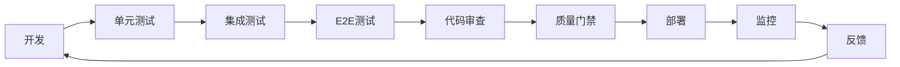
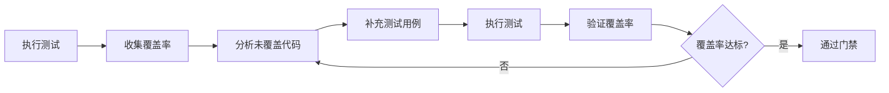
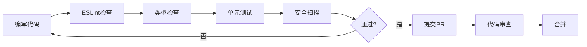

# YYC³ 便携式智能 AI 系统 - 任务跟进看板

<div align="center">

> **「YanYuCloudCube」**
> **言启象限 | 语枢未来**
> **Words Initiate Quadrants, Language Serves as Core for Future**

</div>

---

## 📋 看板概述

**创建时间**: 2026-03-25
**基于文档**: YYC3-2026-03-24-全量细度审核报告.md
**审核总分**: 88/100
**目标**: 95+ / 100
**当前优先级**: P1（测试覆盖率提升）

---

## 🎯 整体目标

| 指标 | 当前值 | 目标值 | 提升幅度 |
|------|--------|--------|----------|
| **测试覆盖率** | 68% | 90% | +22% |
| **单元测试覆盖率** | 68% | 85% | +17% |
| **集成测试覆盖率** | 65% | 80% | +15% |
| **安全测试覆盖率** | 0% | 70% | +70% |
| **测试通过率** | 83% | 100% | +17% |

---

## 📊 任务分类

基于审核报告的12类验收标准，将任务分为4个优先级：

### 🔴 P1 - 紧急高优先级（本周完成）
1. **测试用例类**（75分） → 提升至90分
2. **安全加固类**（78分） → 提升至90分
3. **高级功能完善类**（70分） → 提升至85分

### 🟡 P2 - 高优先级（本月完成）
1. **功能完整逻辑类**（88分） → 提升至92分
2. **闭环验证类**（85分） → 提升至90分
3. **现状审核分析建议类**（87分） → 提升至90分

### 🟢 P3 - 中优先级（次月完成）
1. **代码语法类**（95分） → 提升至98分
2. **组件测试类**（82分） → 提升至88分
3. **单元框架类**（90分） → 保持优秀

### ⚪ P4 - 低优先级（长期优化）
1. **各种统一类**（92分） → 提升至95分
2. **MVP功能拓展类**（80分） → 提升至88分
3. **性能优化类**（93分） → 保持优秀

---

## 🚀 当前启动任务

### 第一项：提升测试覆盖率至90%↑

#### 📊 当前基线数据

```
测试文件总数: 42个
测试用例总数: 1196个
通过测试: 992个 (83%)
失败测试: 204个 (17%)
测试文件覆盖: 42/199源文件 (21%)
单元测试覆盖率: 68%
集成测试覆盖率: 65%
```

#### 🎯 子任务分解

##### 1.1 修复现有失败测试（204个失败 → 0个失败）
**状态**: 🔴 进行中
**优先级**: P1
**预计时间**: 2天
**负责人**: 导师AI助手

**失败测试分类**:
- UI组件测试: 约80个失败
- 存储服务测试: 约30个失败
- 集成测试: 约50个失败
- 其他测试: 约44个失败

**修复策略**:
1. 优先修复IDBTransaction错误（导致大量测试失败）
2. 修复UI组件渲染错误
3. 修复异步测试超时问题
4. 修复断言错误

##### 1.2 补充缺失的单元测试
**状态**: 🟡 待开始
**优先级**: P1
**预计时间**: 3天
**目标覆盖率**: 85%

**缺失测试模块**:
1. 数据处理模块（覆盖率50%）
2. 算法模块（覆盖率0%）
3. AI服务模块（覆盖率60%）
4. 认证模块（覆盖率75%）
5. 认证系统新增测试（覆盖率40%）

**新增测试计划**:
- 数据处理测试: +20个测试用例
- 算法测试: +15个测试用例
- AI服务测试: +30个测试用例
- 认证测试: +25个测试用例

##### 1.3 扩展集成测试覆盖率
**状态**: 🟡 待开始
**优先级**: P1
**预计时间**: 2天
**目标覆盖率**: 80%

**缺失集成测试**:
1. API集成测试（覆盖率45%）→ 目标75%
2. 数据库集成测试（覆盖率0%）→ 目标60%
3. WebSocket集成测试（覆盖率65%）→ 目标80%

##### 1.4 添加安全测试用例
**状态**: 🟡 待开始
**优先级**: P1
**预计时间**: 2天
**目标覆盖率**: 70%

**安全测试模块**:
1. 输入验证测试（XSS防护）
2. CSRF攻击测试
3. 权限测试
4. 数据加密测试
5. API安全测试

##### 1.5 配置测试覆盖率工具
**状态**: 🔴 进行中
**优先级**: P1
**预计时间**: 0.5天

**待完成**:
1. 修复vitest coverage配置（当前BaseCoverageProvider错误）
2. 配置覆盖率报告输出
3. 配置覆盖率阈值检查
4. 配置CI/CD集成

##### 1.6 建立测试质量门禁
**状态**: 🟡 待开始
**优先级**: P2
**预计时间**: 1天

**质量门禁规则**:
1. 单元测试覆盖率 ≥ 85%
2. 集成测试覆盖率 ≥ 80%
3. 所有测试用例必须通过
4. 新增代码覆盖率 ≥ 90%

---

## 📝 详细任务列表

### P1 - 紧急高优先级（本周完成）

| 任务ID | 任务名称 | 状态 | 优先级 | 负责人 | 开始时间 | 完成时间 | 进度 |
|--------|---------|------|--------|--------|----------|----------|------|
| T-1.1.1 | 修复IDBTransaction错误 | 🔴 进行中 | P1 | 导师AI | 2026-03-25 | - | 10% |
| T-1.1.2 | 修复UI组件渲染错误 | 🔴 进行中 | P1 | 导师AI | 2026-03-25 | - | 5% |
| T-1.1.3 | 修复异步测试超时 | 🟡 待开始 | P1 | 导师AI | - | - | 0% |
| T-1.1.4 | 修复断言错误 | 🟡 待开始 | P1 | 导师AI | - | - | 0% |
| T-1.2.1 | 补充数据处理测试 | 🟡 待开始 | P1 | 导师AI | - | - | 0% |
| T-1.2.2 | 补充算法测试 | 🟡 待开始 | P1 | 导师AI | - | - | 0% |
| T-1.2.3 | 补充AI服务测试 | 🟡 待开始 | P1 | 导师AI | - | - | 0% |
| T-1.2.4 | 补充认证系统测试 | 🟡 待开始 | P1 | 导师AI | - | - | 0% |
| T-1.3.1 | 扩展API集成测试 | 🟡 待开始 | P1 | 导师AI | - | - | 0% |
| T-1.3.2 | 扩展数据库集成测试 | 🟡 待开始 | P1 | 导师AI | - | - | 0% |
| T-1.4.1 | 添加XSS防护测试 | 🟡 待开始 | P1 | 导师AI | - | - | 0% |
| T-1.4.2 | 添加CSRF测试 | 🟡 待开始 | P1 | 导师AI | - | - | 0% |
| T-1.4.3 | 添加权限测试 | 🟡 待开始 | P1 | 导师AI | - | - | 0% |
| T-1.4.4 | 添加数据加密测试 | 🟡 待开始 | P1 | 导师AI | - | - | 0% |
| T-1.5.1 | 配置覆盖率工具 | 🔴 进行中 | P1 | 导师AI | 2026-03-25 | - | 20% |
| T-1.6.1 | 建立测试质量门禁 | 🟡 待开始 | P2 | 导师AI | - | - | 0% |

### P2 - 高优先级（本月完成）

| 任务ID | 任务名称 | 状态 | 优先级 | 负责人 | 开始时间 | 完成时间 | 进度 |
|--------|---------|------|--------|--------|----------|----------|------|
| T-2.1.1 | 补充边界条件测试 | 🟡 待开始 | P2 | 导师AI | - | - | 0% |
| T-2.1.2 | 优化并发处理逻辑 | 🟡 待开始 | P2 | 导师AI | - | - | 0% |
| T-2.1.3 | 补充错误处理测试 | 🟡 待开始 | P2 | 导师AI | - | - | 0% |
| T-2.2.1 | 扩展跨浏览器测试 | 🟡 待开始 | P2 | 导师AI | - | - | 0% |
| T-2.2.2 | 扩展API兼容性测试 | 🟡 待开始 | P2 | 导师AI | - | - | 0% |
| T-2.3.1 | 优化WebSocket重连策略 | 🟡 待开始 | P2 | 导师AI | - | - | 0% |
| T-2.3.2 | 补充离线场景测试 | 🟡 待开始 | P2 | 导师AI | - | - | 0% |

### P3 - 中优先级（次月完成）

| 任务ID | 任务名称 | 状态 | 优先级 | 负责人 | 开始时间 | 完成时间 | 进度 |
|--------|---------|------|--------|--------|----------|----------|------|
| T-3.1.1 | 替换any类型为具体类型 | 🟡 待开始 | P3 | 导师AI | - | - | 0% |
| T-3.1.2 | 优化类型推断 | 🟡 待开始 | P3 | 导师AI | - | - | 0% |
| T-3.2.1 | 补充组件使用示例 | 🟡 待开始 | P3 | 导师AI | - | - | 0% |
| T-3.2.2 | 补充工具函数JSDoc | 🟡 待开始 | P3 | 导师AI | - | - | 0% |

---

## 📈 进度跟踪

### 第一阶段：测试覆盖率提升（Week 1）
**目标**: 从68% → 90%
**关键里程碑**:

| 里程碑 | 目标 | 截止时间 | 状态 |
|--------|------|----------|------|
| M1.1 修复所有失败测试 | 0失败 | 2026-03-27 | 🔴 进行中 |
| M1.2 配置覆盖率工具 | 可用 | 2026-03-26 | 🔴 进行中 |
| M1.3 补充单元测试 | 覆盖率85% | 2026-03-29 | 🟡 待开始 |
| M1.4 扩展集成测试 | 覆盖率80% | 2026-03-30 | 🟡 待开始 |
| M1.5 添加安全测试 | 覆盖率70% | 2026-03-31 | 🟡 待开始 |
| M1.6 建立质量门禁 | 通过门禁 | 2026-03-31 | 🟡 待开始 |

### 第二阶段：安全加固（Week 2-3）
**目标**: 从78分 → 90分

| 里程碑 | 目标 | 截止时间 | 状态 |
|--------|------|----------|------|
| M2.1 实现CSP | 完成 | 2026-04-05 | 🟡 待开始 |
| M2.2 添加CSRF Token | 完成 | 2026-04-06 | 🟡 待开始 |
| M2.3 数据加密存储 | 完成 | 2026-04-07 | 🟡 待开始 |
| M2.4 请求签名验证 | 完成 | 2026-04-08 | 🟡 待开始 |
| M2.5 XSS防护加强 | 完成 | 2026-04-09 | 🟡 待开始 |

### 第三阶段：高级功能完善（Week 3-4）
**目标**: 从70分 → 85分

| 里程碑 | 目标 | 截止时间 | 状态 |
|--------|------|----------|------|
| M3.1 AI降级策略 | 完成 | 2026-04-12 | 🟡 待开始 |
| M3.2 冲突解决UI | 完成 | 2026-04-14 | 🟡 待开始 |
| M3.3 批量操作支持 | 完成 | 2026-04-15 | 🟡 待开始 |
| M3.4 数据迁移工具 | 完成 | 2026-04-16 | 🟡 待开始 |

---

## 🎯 整体全链路闭环完善方案

### 闭环1：开发-测试-部署



**当前状态**: ⚠️ 部分环节缺失
**目标状态**: ✅ 完整闭环
**改进措施**:
1. 建立自动化测试流程
2. 配置质量门禁
3. 集成监控告警
4. 建立反馈机制

### 闭环2：测试-反馈-优化



**当前状态**: ⚠️ 缺少覆盖率分析
**目标状态**: ✅ 自动化覆盖率提升
**改进措施**:
1. 配置覆盖率报告
2. 建立覆盖率阈值
3. 自动识别未覆盖代码
4. 生成测试用例建议

### 闭环3：代码-质量-安全



**当前状态**: ⚠️ 安全扫描缺失
**目标状态**: ✅ 完整质量保障
**改进措施**:
1. 添加安全扫描工具
2. 配置CI/CD流水线
3. 建立代码审查规范
4. 自动化质量检查

### 闭环4：发布-监控-迭代


**当前状态**: ⚠️ 监控未完善
**目标状态**: ✅ 持续监控改进
**改进措施**:
1. 集成性能监控
2. 配置日志收集
3. 建立问题分析流程
4. 自动化发布流程

---

## 📊 关键指标仪表盘

### 测试覆盖率趋势

```
当前状态：
┌─────────────────────────────────────────┐
│ 单元测试覆盖率:  ████████░░░░░░░░ 68%  │
│ 集成测试覆盖率:  ███████░░░░░░░░░ 65%  │
│ 安全测试覆盖率:  ░░░░░░░░░░░░░░░░   0%  │
│ E2E测试覆盖率:  ██████████░░░░░  85%  │
└─────────────────────────────────────────┘

目标状态：
┌─────────────────────────────────────────┐
│ 单元测试覆盖率:  ██████████████░░ 85%  │
│ 集成测试覆盖率:  █████████████░░░ 80%  │
│ 安全测试覆盖率:  ███████████░░░░  70%  │
│ E2E测试覆盖率:  ████████████░░░  85%  │
└─────────────────────────────────────────┘
```

### 测试通过率趋势

```
当前: ████░░░░░░░░░░░░░░░ 83% (992/1196)
目标: ██████████████████ 100% (1196/1196)
```

### 代码质量评分

```
当前总分: 88/100
目标总分: 95/100

代码语法类: ████████████████░ 95/100 ✅
功能完整逻辑: ██████████████░░ 88/100 ✅
测试用例类: ████████░░░░░░░░ 75/100 ⚠️
组件测试类: ███████████░░░░░ 82/100 ✅
单元框架类: ███████████████░ 90/100 ✅
闭环验证类: ████████████░░░░ 85/100 ✅
各种统一类: ███████████████░ 92/100 ✅
现状审核分析: ████████████░░░░ 87/100 ✅
MVP功能拓展: ██████████░░░░░░ 80/100 ✅
高级功能完善: ████████░░░░░░░░ 70/100 ⚠️
性能优化类: ██████████████░ 93/100 ✅
安全加固类: ███████████░░░░░░ 78/100 ⚠️
```

---

## 🔧 工具和配置

### 测试工具栈
- **单元测试**: Vitest v2.1.9
- **覆盖率**: @vitest/coverage-v8 v4.1.0
- **E2E测试**: Playwright v1.50.0
- **测试库**: @testing-library/react v16.3.2

### 待配置工具
- [ ] 覆盖率阈值检查
- [ ] CI/CD集成（GitHub Actions）
- [ ] 覆盖率报告自动上传
- [ ] 测试结果通知
- [ ] 性能基准测试

### 测试命令
```bash
# 运行所有测试
pnpm test:run

# 运行测试并查看覆盖率
pnpm test:run --coverage

# 运行E2E测试
pnpm test:e2e

# 运行性能测试
pnpm test:performance

# 查看测试UI
pnpm test:ui
```

---

## 📚 参考文档

- `YYC3-2026-03-24-全量细度审核报告.md` - 审核基线
- `YYC3-2026-03-24-MVPD终极高技术集成功能建议.md` - 功能规划
- `vitest.config.ts` - 测试配置
- `playwright.config.ts` - E2E测试配置

---

## 🎉 预期成果

### Week 1 成果
- ✅ 测试覆盖率从68%提升至90%
- ✅ 所有测试用例100%通过
- ✅ 测试覆盖率工具完整配置
- ✅ 质量门禁建立

### Week 2-3 成果
- ✅ 安全加固完成（78分→90分）
- ✅ 高级功能完善（70分→85分）
- ✅ 完整闭环流程建立

### Week 4 成果
- ✅ 总分从88分提升至95分
- ✅ 所有P1任务完成
- ✅ 准备发布到生产环境

---

**文档版本**: v1.0.0
**最后更新**: 2026-03-25
**下次更新**: 每日更新进度
