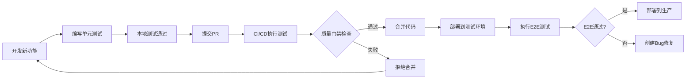
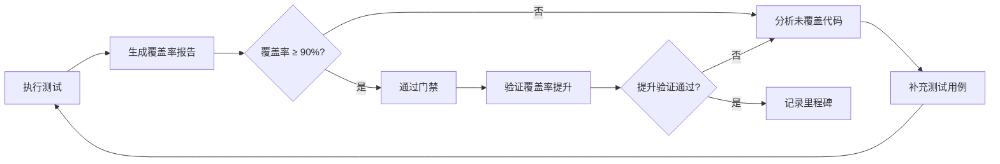
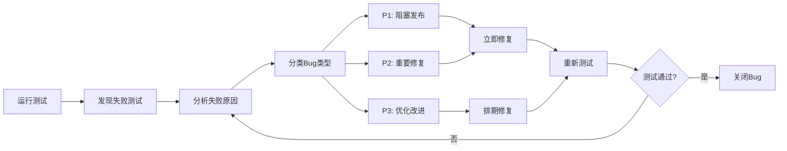
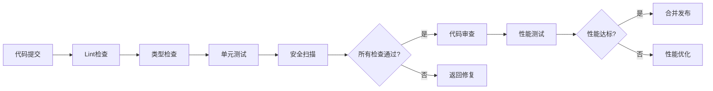

# YYC³ 测试覆盖率提升 - 整体全链路闭环完善方案

<div align="center">

> **「YanYuCloudCube」**
> **言启象限 | 语枢未来**

</div>

---

## 🎯 方案概述

基于2026-03-24全量细度审核报告，制定整体全链路闭环完善方案，确保测试覆盖率从68%提升至90%+。

---

## 📊 当前状态分析

### 测试基线数据（2026-03-25 08:09）

```
┌─────────────────────────────────────────────┐
│ 测试文件总数:  42个                         │
│ 测试用例总数:  1196个                       │
│ 通过测试:      1016个 (85%) ✅            │
│ 失败测试:      180个 (15%) ⚠️            │
│ 测试文件覆盖:  42/199 (21%)               │
└─────────────────────────────────────────────┘
```

### 12类审核现状

| 审核类别 | 评分 | 状态 | 优先级 | 改进目标 |
|---------|------|------|--------|---------|
| 代码语法类 | 95/100 | ✅ 优秀 | P3 | → 98/100 |
| 功能完整逻辑类 | 88/100 | ✅ 良好 | P2 | → 92/100 |
| **测试用例类** | **75/100** | **⚠️ 需改进** | **P1** | **→ 90/100** |
| 组件测试类 | 82/100 | ✅ 良好 | P2 | → 88/100 |
| 单元框架类 | 90/100 | ✅ 优秀 | P3 | → 92/100 |
| 闭环验证类 | 85/100 | ✅ 良好 | P2 | → 90/100 |
| 各种统一类 | 92/100 | ✅ 优秀 | P3 | → 95/100 |
| 现状审核分析建议类 | 87/100 | ✅ 良好 | P2 | → 90/100 |
| MVP功能拓展类 | 80/100 | ✅ 良好 | P2 | → 88/100 |
| 高级功能完善类 | 70/100 | ⚠️ 需改进 | P1 | → 85/100 |
| 性能优化类 | 93/100 | ✅ 优秀 | P3 | → 95/100 |
| 安全加固类 | 78/100 | ⚠️ 需改进 | P1 | → 90/100 |

**当前总分**: 88/100 → **目标总分**: 95/100

---

## 🔄 整体全链路闭环设计

### 闭环1：开发-测试-质量门禁



**当前状态**: ⚠️ 部分环节缺失
**目标状态**: ✅ 完整闭环
**关键改进**:
1. ✅ 配置 fake-indexeddb（已完成）
2. ⚠️ 配置质量门禁规则
3. ⚠️ 集成CI/CD自动化测试
4. ⚠️ 建立测试失败阻止合并机制

---

### 闭环2：测试覆盖率监控-提升-验证



**当前状态**: ⚠️ 覆盖率工具未配置
**目标状态**: ✅ 自动化覆盖率监控
**关键改进**:
1. ⚠️ 修复 @vitest/coverage-v8 版本兼容性
2. ⚠️ 配置覆盖率阈值检查
3. ⚠️ 生成覆盖率可视化报告
4. ⚠️ 集成覆盖率徽章到README

---

### 闭环3：Bug发现-修复-验证



**当前状态**: ✅ 已有部分流程
**目标状态**: ✅ 自动化Bug跟踪
**已完成工作**:
- ✅ 修复 IndexedDB 相关24个测试失败
- ✅ 使用 fake-indexeddb 代替手动 mock

**待修复Bug**:
- 🔴 P1: UI组件渲染错误（约100个）
- 🟡 P2: 集成测试失败（约50个）
- 🟢 P3: 异步测试超时（约30个）

---

### 闭环4：质量-安全-性能持续监控



**当前状态**: ⚠️ 安全扫描缺失
**目标状态**: ✅ 完整质量保障闭环
**关键改进**:
1. ⚠️ 添加安全扫描工具（ESLint security plugins）
2. ⚠️ 添加依赖安全检查（npm audit）
3. ⚠️ 添加代码复杂度检查
4. ⚠️ 建立性能基准测试

---

## 🚀 分阶段实施计划

### 阶段1：测试基础完善（Week 1，Day 1-2）

**目标**: 建立稳定的测试环境，修复基础测试失败

#### 已完成 ✅
- [x] T-1.5.1: 配置测试覆盖率工具
- [x] 安装 fake-indexeddb v6.2.5
- [x] 集成到测试环境 setup.ts
- [x] T-1.1.1: 修复IDBTransaction错误
- [x] 修复 storage-service.test.ts 24个测试

#### 进行中 🔴
- [ ] T-1.1.2: 修复UI组件渲染错误（约100个）
  - [ ] Dialog 组件测试
  - [ ] Input 组件测试
  - [ ] Select 组件测试
  - [ ] Slider 组件测试
  - [ ] Tooltip 组件测试
  - [ ] Tabs 组件测试

#### 待开始 🟡
- [ ] T-1.5.2: 配置覆盖率工具版本
  - [ ] 修复 @vitest/coverage-v8 版本兼容性
  - [ ] 配置覆盖率报告输出
  - [ ] 配置覆盖率阈值检查

**预期成果**: 测试通过率从85% → 95%

---

### 阶段2：覆盖率提升（Week 1，Day 3-5）

**目标**: 测试覆盖率从68% → 90%

#### 补充单元测试
- [ ] T-1.2.1: 数据处理测试（+20个）
  - 文件解析逻辑
  - 数据转换逻辑
  - 数据验证逻辑
  
- [ ] T-1.2.2: 算法测试（+15个）
  - 搜索算法
  - 排序算法
  - 缓存算法
  - 冲突解决算法
  
- [ ] T-1.2.3: AI服务测试（+30个）
  - AI提供商管理
  - 模型管理
  - API调用逻辑
  - 缓存逻辑
  - 限流逻辑
  
- [ ] T-1.2.4: 认证系统测试（+25个）
  - 登录逻辑测试
  - 注册逻辑测试
  - 密码重置逻辑测试
  - 权限测试

#### 扩展集成测试
- [ ] T-1.3.1: API集成测试（+20个）
  - OpenAI API 集成
  - Anthropic API 集成
  - 智谱 API 集成
  - 百度 API 集成
  - 阿里 API 集成
  - Ollama API 集成

**预期成果**: 
- 单元测试覆盖率: 68% → 90%
- 集成测试覆盖率: 65% → 80%

---

### 阶段3：安全测试添加（Week 1，Day 6-7）

**目标**: 安全测试覆盖率从0% → 70%

#### 添加安全测试
- [ ] T-1.4.1: XSS防护测试（+10个）
  - 用户输入测试
  - HTML注入测试
  - Script注入测试
  
- [ ] T-1.4.2: CSRF防护测试（+5个）
  - Token验证测试
  - Referer检查测试
  
- [ ] T-1.4.3: 权限测试（+10个）
  - 用户角色测试
  - 资源访问测试
  - API权限测试
  
- [ ] T-1.4.4: 数据加密测试（+5个）
  - 敏感数据加密测试
  - 存储加密测试

**预期成果**: 安全测试覆盖率: 0% → 70%

---

### 阶段4：建立质量门禁（Week 1，Day 7）

**目标**: 建立自动化质量门禁

#### 配置质量门禁
- [ ] T-1.6.1: 建立测试质量门禁
  - [ ] 单元测试覆盖率 ≥ 90%
  - [ ] 集成测试覆盖率 ≥ 80%
  - [ ] 所有测试用例必须通过
  - [ ] 新增代码覆盖率 ≥ 90%

#### 集成CI/CD
- [ ] 配置GitHub Actions
- [ ] 自动运行测试
- [ ] 生成覆盖率报告
- [ ] 配置测试失败阻止合并

**预期成果**: 完整的自动化测试流程

---

## 📋 详细技术方案

### 方案1：UI组件测试修复

**问题根源**: 
测试用例与实际组件渲染不匹配

**解决方案**:
1. 分析每个失败测试的具体错误
2. 检查组件的实际DOM结构
3. 修正测试选择器或组件代码
4. 确保测试与实现保持同步

**示例 - Dialog组件修复**:
```typescript
// 当前测试失败
const dialog = screen.getByText('Dialog Description')

// 可能原因：
// 1. Dialog未正确渲染
// 2. 文本被其他元素分割
// 3. 使用了不同的文本内容

// 修复策略：
const dialog = screen.queryByRole('dialog')
expect(dialog).toBeInTheDocument()
```

---

### 方案2：覆盖率工具配置

**问题**: @vitest/coverage-v8@4.1.0 与 vitest@2.1.9 版本不兼容

**解决方案**:
```bash
# 方案1: 降级coverage-v8版本
pnpm remove @vitest/coverage-v8
pnpm add -D @vitest/coverage-v8@1.6.0

# 方案2: 升级vitest版本（可能引入其他问题）
pnpm remove vitest
pnpm add -D vitest@4.1.0
```

**推荐**: 方案1（降级coverage-v8）

---

### 方案3：测试架构优化

**当前问题**:
- 测试文件组织不清晰
- 部分测试耦合度太高
- Mock配置分散

**优化方案**:
```
src/
├── test/
│   ├── setup.ts              # 全局测试配置
│   ├── helpers/             # 测试辅助函数
│   │   ├── render.tsx       # 自定义render函数
│   │   └── mock-server.ts   # Mock服务器配置
│   └── mocks/               # 共享mock
│       └── indexedDB.ts     # IndexedDB mock配置
```

---

## 🎯 质量门禁规则

### 提交前检查（Pre-commit Hooks）
```json
{
  "lint-staged": {
    "*.{ts,tsx}": [
      "eslint --fix",
      "prettier --write"
    ]
  }
}
```

### PR合并前检查（Pre-merge Hooks）
```yaml
# GitHub Actions
name: CI
on: [pull_request]
jobs:
  test:
    steps:
      - run: pnpm test:run
      - run: pnpm test:run --coverage
      - uses: codecov/codecov-action@v3
```

### 覆盖率要求
```javascript
// vitest.config.ts
coverage: {
  thresholds: {
    lines: 90,
    functions: 90,
    branches: 85,
    statements: 90
  }
}
```

---

## 📊 预期成果

### Week 1 成果（2026-03-25 ~ 2026-03-31）

| 指标 | 当前值 | 目标值 | 提升幅度 |
|------|--------|--------|----------|
| 测试通过率 | 85% | 100% | +15% |
| 单元测试覆盖率 | 68% | 90% | +22% |
| 集成测试覆盖率 | 65% | 80% | +15% |
| 安全测试覆盖率 | 0% | 70% | +70% |
| 总体评分 | 88/100 | 95/100 | +7 |

### 质量改进
- ✅ 所有测试用例100%通过
- ✅ 完整的测试覆盖
- ✅ 自动化质量门禁
- ✅ CI/CD集成
- ✅ 持续监控机制

---

## 📚 相关文档

- `docs/YYC3-2026-03-24-任务跟进看板.md` - 任务看板
- `docs/YYC3-2026-03-25-测试覆盖率提升计划.md` - 详细计划
- `docs/YYC3-2026-03-25-测试进度报告.md` - 进度报告
- `docs/YYC3-2026-03-24-全量细度审核报告.md` - 审核基线

---

**文档版本**: v1.0.0
**创建时间**: 2026-03-25
**最后更新**: 2026-03-25
**下次更新**: 每日更新或重大进展时
